# NPM Dependency Backdater

 

A tool to update NPM dependencies to the latest version available at a specified date.

For those working on projects without version control, or even those who are but don't want to find the commit at the perfect, this is the tool for you!

Maybe you want to update all your packages without breaking anything, well you can lock to the current major or minor versions to do just that!

Perhaps you're an expert, and want to automate your manual process of updating packages, well interactive mode is built for you - you'll be prompted for each possible update!

## Table of Contents

- [NPM Dependency Backdater](#npm-dependency-backdater)
  - [Table of Contents](#table-of-contents)
  - [Usage](#usage)
  - [Options](#options)
  - [How it works](#how-it-works)
  - [How it's made](#how-its-made)
  - [Development](#development)
    - [Sequence diagram of Events](#sequence-diagram-of-events)

## Usage

```bash
npm install -g RascalTwo/npm-dependency-backdater
npm-dependency-backdater package.json 2023-01-01
# or to update them all to their latest versions, omit the datetime
npm-dependency-backdater package.json
```

## Options

```bash
npm-dependency-backdater <package.json location> [<datetime>] [--silent] [--tui] [--strip-prefixes] [--interactive] [--allow-pre-release] [--dry-run] [--preload-dependencies] [--no-cache] [--lock-major] [--lock-minor] [--warnings-as-errors] [--delay[=milliseconds]]

package.json location: The location of the package.json file to update
datetime: The datetime to update the package versions to (YYYY-MM-DDTHH:mm:ssZ)
          Defaults to the current time if not provided
```

- `--silent`
  - Whether to suppress logging
- `--tui`
  - Whether to use a text-based user interface (TUI) instead of the command line
- `--strip-prefixes`
  - Whether to strip the (>=, <=, >, <, ~, ^) prefixes from the updated versions
- `--interactive`
  - Whether to prompt the user before updating each package version
- `--allow-pre-release`
  - Whether to allow the latest version to be a pre-release version (e.g. 1.0.0-alpha.1)
- `--dry-run`
  - Whether to log the changes that would be made without actually making them
- `--preload-dependencies`
  - Whether to preload all package names before updating them
- `--no-cache`
  - Whether to ignore the cache when getting package version dates
- `--lock-[major/minor]`
  - Prevent updating the major/minor version of a package
- `--warnings-as-errors`
  - Treat warnings as errors, exiting the program if any are encountered
- `--delay[=milliseconds]`
  - Milliseconds to wait between events, defaults to 1000

## How it works

This tool uses the [NPM registry API](https://github.com/npm/registry/blob/master/docs/REGISTRY-API.md) to get the versions and release dates of each package, and then updates the package.json file with the latest version available at the specified date.

> It intelligently caches the NPM registry API responses, so that it doesn't have to make a request for packages it already knows about - and will only make requests when they're unknown or when the specified date is newer than the cached date.

## How it's made

This tool is written in [TypeScript](https://www.typescriptlang.org/), and uses the [`node-fetch`](https://www.npmjs.com/package/node-fetch) package to make HTTP requests.

Fully following Test-Driven-Development via [`jest`](https://jestjs.io/), with [`eslint`](https://eslint.org/) and [`prettier`](https://prettier.io/) maintaining code consistency - and [`husky`](https://www.npmjs.com/package/husky) to ensure these tools are not forgotten.

## Development

The primary `main()` method along with the base and CLI event listeners have been exposed for custom implementation, an example of this can be seen in [`examples/custom-event-listener/src/index.ts`](examples/custom-event-listener/src/index.ts)

### Sequence diagram of Events

```mermaid
sequenceDiagram
    participant P as Program
    participant E as Event Listener

    break arguments are missing
        P ->> E: handleMissingArguments
    end

    break provided datetime is invalid
        P ->> E: handleInvalidDatetime
    end

    critical provided datetime
        option is invalid
            break
                P ->> E: handleInvalidDatetime
            end

        option is in future
            P ->> E: handleDatetimeInFuture
            E -->> P: Date to use
    end

    P ->> E: initialize
    E -->> P: &nbsp;

    P ->> E: handleRunStart
    E -->> P: &nbsp;

    P ->> E: handleReadingPackageFileStart
    E -->> P: &nbsp;

    P ->> E: handleReadingPackageFileFinish
    E -->> P: &nbsp;

    critical dependencies
        option being preloaded
            loop dependency map type
                P ->> E: handleDiscoveringDependencyMapStart
                E -->> P: &nbsp;

                P ->> E: handleDiscoveringDependencyMapFinish
                E -->> P: &nbsp;

                loop dependency in dependency map
                    P ->> E: handleGettingPackageVersionDatesStart
                    E -->> P: &nbsp;

                    P ->> E: handleGettingPackageVersionDatesFinish
                    E -->> P: &nbsp;

                    P ->> E: handleCalculatedHighestVersion
                    E -->> P: &nbsp;

                    critical highest version isn't what's currently being used
                        P ->> E: handlePromptUserForVersionAction
                        E -->> P: version to use
                    end

                    P ->> E: handleDependencyProcessed
                    E -->> P: &nbsp;
                end

                P ->> E: handleDependencyMapProcessed
                E -->> P: &nbsp;
            end
        option as found
            loop dependency map type
                P ->> E: handleDiscoveringDependencyMapStart
                E -->> P: &nbsp;

                P ->> E: handleDiscoveringDependencyMapFinish
                E -->> P: &nbsp;
            end
            loop dependency in dependency map
                P ->> E: handleGettingPackageVersionDatesStart
                E -->> P: &nbsp;

                P ->> E: handleGettingPackageVersionDatesFinish
                E -->> P: &nbsp;

                P ->> E: handleCalculatedHighestVersion
                E -->> P: &nbsp;

                critical highest version isn't what's currently being used
                    P ->> E: handlePromptUserForVersionAction
                    E -->> P: version to use
                end

                P ->> E: handleDependencyProcessed
                E -->> P: &nbsp;
            end

            P ->> E: handleDependencyMapProcessed
            E -->> P: &nbsp;
    end


    P ->> E: handleChangesMade
    E -->> P: &nbsp;

    critical if changes made
        P ->> E: handleMakeChanges
        E -->> P: &nbsp;
    end

    P ->> E: handleRunFinish
    E -->> P: &nbsp;
```


